# Coprocessador de Imagens com Interface HPS–FPGA

[](https://www.terasic.com.tw/cgi-bin/page/archive.pl?Language=English&No=836)
[](https://www.intel.com/content/www/us/en/software/programmable/quartus-prime/overview.html)
[](https://developer.arm.com/ip-products/processors/cortex-a/cortex-a9)
[](LICENSE)

**Problema 3 – Sistemas Digitais (TEC499) 2025.2**  
**Universidade Estadual de Feira de Santana (UEFS)**

---

## 📋 Índice

- [Sobre o Projeto](#-sobre-o-projeto)
- [Declaração do Problema](#-declaração-do-problema)
- [Requisitos do Sistema](#-requisitos-do-sistema)
- [Arquitetura da Solução](#-arquitetura-da-solução)
- [Manual do Sistema](#-manual-do-sistema)
  - [Modificações no Hardware (FPGA)](#modificações-no-hardware-fpga)
  - [Integração HPS–FPGA](#integração-hpsfpga)
  - [Sistema HPS (Software)](#sistema-hps-software)
- [Manual do Usuário](#-manual-do-usuário)
- [Testes e Validação](#-testes-e-validação)
- [Resultados Alcançados](#-resultados-alcançados)
- [Ambiente de Desenvolvimento](#-ambiente-de-desenvolvimento)
- [Referências](#-referências)
- [Equipe](#-equipe)

---

## 🎯 Sobre o Projeto

Este projeto foi desenvolvido como parte do **Problema 3** da disciplina **Sistemas Digitais (TEC499)** da **Universidade Estadual de Feira de Santana (UEFS)**. O objetivo central é compreender e aplicar os conceitos de **programação em Assembly e integração software–hardware**, por meio da **implementação de uma biblioteca de controle (API)** e de uma **aplicação em linguagem C** destinada ao gerenciamento de um **coprocessador gráfico** na plataforma **DE1-SoC**.


###  Entregas do Projeto

**Etapa 2 (Concluída):**
- ✅ API em Assembly para controle do coprocessador
- ✅ ISA (Instruction Set Architecture) implementada
- ✅ Comunicação HPS–FPGA via PIOs
- ✅ Sistema de escrita de pixels na VRAM

**Etapa 3 (Concluída):**
- ✅ Aplicação em C para interface de usuário
- ✅ Carregamento de imagens BITMAP
- ✅ Controle de zoom in/out via teclado
- ✅ Escolha de janela de zoom via mouse
- ✅ Efeito de lupa

---

##  Declaração do Problema

### Contexto

Você faz parte de uma equipe contratada para projetar um **módulo embarcado de redimensionamento de imagens** para sistemas de vigilância e exibição em tempo real. O hardware deverá aplicar efeitos de **zoom (ampliação)** ou **downscale (redução)**, simulando interpolação visual básica.

### Desafio Principal

Desenvolver um sistema híbrido HPS–FPGA capaz de:

1. **Receber imagens** em formato BITMAP (160×120 pixels, 8 bits grayscale);
2. **Processar** através de algoritmos de redimensionamento em hardware;
3. **Exibir** o resultado via VGA em tempo real;
4. **Controlar** operações através de software no processador ARM.

### Abordagem

O projeto foi dividido em 3 etapas:

- **Problema 1:** Desenvolvimento do coprocessador em FPGA puro;
- **Problema 2:** Criação da API Assembly e integração HPS–FPGA *(foco deste documento)*;
- **Problema 3:** Aplicação em C com interface de usuário;

---

## Requisitos do Sistema

### Requisitos Funcionais

| ID | Requisito | Status |
|----|-----------|--------|
| RF01 | API desenvolvida em Assembly ARM | ✅ Completo |
| RF02 | Suporte a 4 algoritmos de redimensionamento | ✅ Completo |
| RF03 | Imagens em grayscale 8 bits | ✅ Completo |
| RF04 | Leitura de arquivos BITMAP | ✅ Completo |
| RF05 | Transferência HPS → FPGA | ✅ Completo |
| RF06 | Saída VGA funcional | ✅ Completo |
| RF07 | Aplicação C com interface texto | ✅ Completo |
| RF08 | Controle via teclado (+/- para zoom) | ✅ Completo |
| RF09 | Seleção de janela de zoom por mouse | ✅ Completo |


### Restrições Técnicas

- Uso exclusivo de componentes disponíveis na placa DE1-SoC;
- Compatibilidade ARM Cortex-A9 (HPS);
- Memória VRAM limitada a 76.800 pixels;
- Comunicação via barramento Lightweight HPS-to-FPGA.

---

## 🏗️ Arquitetura da Solução

### Visão Geral

O sistema é dividido em três camadas principais:

```
┌─────────────────────────────────────────────────────┐
│                APLICAÇÃO (C)                        │
│  - Interface usuário                                │
│  - Leitura BITMAP                                   │
│  - Controle de zoom                                 │
│  - Captura do mouse                                 │
│  - Cálculo de dimensão da janela                    │
└────────────────┬────────────────────────────────────┘
                 │
┌────────────────▼────────────────────────────────────┐
│              API (Assembly ARM)                     │
│  - iniciarAPI() / encerrarAPI()                     │
│  - write_pixel()                                    │
│  - NHI() / replicacao() / decimacao() / media()     │
│  - Flag_Done()                                      │
│  - reset_system()                                   │
│  - set_janela()                                     │
│  - write_mouse_coords()                             │
└────────────────┬────────────────────────────────────┘
                 │
        ┌────────▼─────── ──┐
        │   PONTE HPS-FPGA  │
        │   (PIOs Avalon)   │
        └────────┬──────────┘
                 │
┌────────────────▼────────────────────────────────────┐
│          COPROCESSADOR (Verilog)                    │
│  ┌──────────────────────────────────────────────┐   │
│  │  Unidade de Controle (FSM Principal)         │   │
│  └────┬─────────────────────────────────┬───────┘   │
│       │                                 │           │
│  ┌────▼─────────────┐        ┌─────────▼────────┐   │
│  │ Controlador      │        │   FSM Escrita    │   │
│  │ Redimensionamento│        │   (Pixels HPS)   │   │
│  └────┬─────────────┘        └─────────┬────────┘   │
│       │                                 │           │
│  ┌────▼─────────────────────────────────▼────────┐  │
│  │        RAM Dual-Port (76.800 pixels)          │  │
│  │  Porta A: Escrita HPS  |  Porta B: Leitura    │  │
│  └────────────────────┬──────────────────────────┘  │
│                       │                             │
│  ┌────────────────────▼──────────────────────────┐  │
│  │  Algoritmos de Redimensionamento              │  │
│  │  - Replicação  - Decimação                    │  │
│  │  - NHI (Vizinho Próximo)  - Média de Blocos   │  │
│  └────────────────────┬──────────────────────────┘  │
│                       │                             │
│  ┌────────────────────▼──────────────────────────┐  │
│  │          Controlador VGA                      │  │
│  └─────────────────────────────────────────── ───┘  │
└────────────────────────────────────────────────── ──┘
                        │
                  ┌─────▼──── ──┐
                  │   Monitor   │
                  │     VGA     │
                  └─────────────┘
```

### Fluxo de Dados

1. **Entrada:** Usuário carrega BITMAP via aplicação C;
2. **Processamento SW:** Aplicação lê arquivo, extrai pixels e gerencia a lógica de controle interativo (posição do mouse, seleção de janela, comandos de teclado);
3. **Transferência:** API Assembly envia:

    - Pixels para FPGA via write_pixel() para a RAM.
    - Coordenadas do mouse via write_mouse_coords() para PIO_COORDS_MOUSE (0x70).
    - Coordenadas e dimensões da janela via set_janela() para PIO_JANELA_POS (0x50) e PIO_JANELA_DIM (0x60).
      
4. **Armazenamento/Configuração:** FSM de Escrita grava a imagem original na RAM1. Os novos PIOs configuram os registradores de Janela no Controlador de Redimensionamento;
5. **Processamento HW:** Algoritmo selecionado processa apenas a Janela definida pelos PIOs, lendo dados da RAM1 e gravando o resultado ampliado na RAM2;
6. **Saída:** Resultado exibido em monitor VGA, que sobrepõe a imagem ampliada (RAM2) sobre a imagem original (RAM1), além de desenhar o cursor do mouse (configurado pelo PIO 0x70).

### Fluxo de Controle

```mermaid
sequenceDiagram
    participant User as Usuário
    participant App as Aplicação C
    participant API as API Assembly
    participant PIO as PIOs
    participant FSM as FSM Principal (UC)
    participant ALG as Algoritmo (CTR)
    
    %% Rastreamento e Configuração da Janela (Nova Etapa 3)
    loop Rastreamento Contínuo
        User->>App: Mover Mouse
        App->>API: write_mouse_coords(x, y)
        API->>PIO: Escreve PIO_COORDS_MOUSE (0x70)
    end
    
    User->>App: Selecionar Janela (2 cliques)
    App->>API: set_janela(x, y, L, A)
    API->>PIO: Escreve PIO_JANELA_POS (0x50)
    API->>PIO: Escreve PIO_JANELA_DIM (0x60)
    
    %% Comando de Zoom (Nova Etapa 3)
    User->>App: Tecla Zoom (+ ou -)
    App->>API: Chama função (ex: NHI, escala)
    
    %% Execução do Redimensionamento (Janela-Ajustada)
    API->>PIO: Escreve instrução (OPCODE + Escala)
    API->>PIO: Pulso START
    PIO->>FSM: Sinal start=1
    FSM->>ALG: Ativa processamento (usando limites da Janela)
    ALG->>FSM: done_redim=1
    FSM->>PIO: DONE=1
    API->>PIO: Lê DONE (polling)
    API->>App: Retorna sucesso
    App->>User: Exibe resultado (Janela atualizada)
```



---

## 📚 Manual do Sistema

Esta seção contém informações técnicas detalhadas para **engenheiros de computação** que precisem entender, manter ou expandir o sistema.

---

<details>
<summary><h3>📦 Modificações no Hardware (FPGA)</h3></summary>

### Contexto Histórico

---

Enquanto o coprocessador da Etapa 2 estabeleceu a modularidade, o uso da RAM Dual-Port e a comunicação PIO-HPS, o foco da Etapa 3 foi estender essa arquitetura para suportar interação em tempo real, permitindo que o processamento do redimensionamento fosse aplicado a uma Região de Interesse (ROI) dinâmica, controlada pela aplicação em C via mouse e teclado.

Essa mudança exigiu ajustes críticos no fluxo de controle e endereçamento dentro da FPGA. 
As principais diferenças estão resumidas a seguir:

| Aspecto | Arquitetura da Etapa 2 (API/HPS) | Arquitetura da Etapa 3 (Interativo/Janela) |
| :--- | :--- | :--- |
| Domínio de Operação | Redimensionamento aplicado à **imagem inteira**. | Redimensionamento aplicado a uma **Janela** definida pelo HPS. |
| Controle de Leitura | Endereçamento sempre inicia em **(0, 0)** da RAM de origem. | Endereçamento na RAM1 é **deslocado** para **(janela\_x\_inicio, janela\_y\_inicio)**. |
| Controle de Escrita | Escrita na RAM2 inicia em **(0, 0)** e cobre a tela de destino. | Escrita na RAM2 inicia em **(0, 0)** e cobre **apenas a janela ampliada**. |
| Entradas de Controle | `start`, `algorithm` e `zoom` via PIOs. | Entradas da Etapa 2 **mais 4 parâmetros** para a janela e **2 coordenadas** para o cursor do mouse. |
| Integração com HPS | Transferência de pixels e comando de execução. | Transferência de pixels, comando de execução **e fluxo contínuo de coordenadas de Janela/Mouse**. |

Em síntese, o coprocessador na Etapa 3 manteve a estrutura modular do Controlador e dos Algoritmos, mas a Unidade de Controle e o ControladorRedimensionamento foram estendidos para processar o contexto de janela recebido através de novos PIOs.

Os próximos tópicos abordarão com mais detalhamento as principais mudanças feitas no circuito.

---


#### 🔹 1. Controlador de Redimensionamento (Ajuste para Janela)

O módulo **`ControladorRedimensionamento.v`** sofreu a modificação mais importante no hardware, adaptando sua lógica de endereçamento para trabalhar com a **Janela**.
Novas Entradas na Etapa 3 (Recebidas da Unidade de Controle/PIOs).

**Estrutura:**
```verilog
module ControladorRedimensionamento (...)
    // ...
    input  wire [8:0]  janela_x_inicio,    // Posição X (Canto superior esquerdo)
    input  wire [7:0]  janela_y_inicio,    // Posição Y (Canto superior esquerdo)
    input  wire [10:0] janela_largura,     // Largura da Janela
    input  wire [9:0]  janela_altura,      // Altura da Janela
    // ...
);
```

**Funcionamento Modificado:**

1. **Leitura (RAM1):**
   - Antes
   ```verilog
   mem1_addr = y_orig * LARGURA_ORIG + x_orig
   ```
   - Depois
   ```verilog
   mem1_addr = (y_orig + janela_y_inicio) * LARGURA_ORIG +
            (x_orig + janela_x_inicio)
   ```
3. **Laços de processamento:** Limitados por janela_largura e janela_altura.

4. **Escrita (RAM2):** A escrita inicia em (0, 0), mas cobre apenas a área ampliada da Janela, que será sobreposta via VGA.

**Importante:** Este módulo **não substitui** a FSM principal, apenas gerencia o **fluxo de redimensionamento**.

---

#### 🔹 4.RAM Dual-Port de trabalho

A RAM2 agora assume um papel duplo na Etapa 3:

| Característica | RAM1 | RAM2 |
|----------------|------------------|----------------------------|
| **Função** | Armazenamento da Imagem Original (Escrita pelo HPS) | Armazenamento do Resultado do Zoom (Janela) (Escrita pelo Controlador). |
| **Acesso Escrita** | HPS (via FSM de Escrita) | ControladorRedimensionamento |
| **Acesso Leitura** | ControladorRedimensionamento | Driver VGA (para sobreposição da janela ampliada) |

#### 🔹 5. Unidade de Controle e Comunicação (Novos Canais)

A `UnidadeControle.v` e, consequentemente, o `ghrd_top.v` foram expandidos para mapear os novos canais PIO necessários para a interatividade:

| Novo PIO | Endereço | Propósito | Implementação no Código |
| :--- | :--- | :--- | :--- |
| **PIO\_JANELA\_POS** | `0x50` | Posição (x\_inicio, y\_inicio) da Janela. | Recebido pela `UnidadeControle.v` via `janela_pos[31:0]`. |
| **PIO\_JANELA\_DIM** | `0x60` | Dimensões (largura, altura) da Janela. | Recebido pela `UnidadeControle.v` via `janela_dim[31:0]`. |
| **PIO\_COORDS\_MOUSE** | `0x70` | Coordenadas (x, y) do cursor do mouse. | Recebido pela `UnidadeControle.v` e usado pelo driver VGA para desenhar o cursor. |

</details>

---

<details>
<summary><h3>🔗 Integração HPS–FPGA</h3></summary>


### Integração HPS-FPGA

A integração foi desenvolvida sobre o **`my_first_fpga-hps_base`**, projeto de referência oficial da Intel que fornece:

- ✅ Controlador DDR3 configurado;
- ✅ Barramentos AXI e Avalon-MM;
- ✅ Ponte Lightweight HPS-to-FPGA;
- ✅ Clock e reset sincronizados;
- ✅ Interfaces Ethernet, USB, UART, GPIO.

**Por que usar o projeto base?**

Implementar manualmente a infraestrutura HPS–FPGA exigiria:
- Configurar timings DDR3 (dezenas de parâmetros);
- Sincronizar múltiplos domínios de clock;
- Implementar protocolos AXI/Avalon;
- Configurar sequência de boot do ARM.

O `my_first_fpga-hps_base` **resolve tudo isso automaticamente**.

---

### Arquitetura de Comunicação

```
```mermaid
┌─────────────────────────────────────────────┐
│           ARM Cortex-A9 (HPS)               │
│  ┌──────────────────────────────────────┐   │
│  │  Aplicação C + API Assembly          │   │
│  │  /dev/mem (0xFF200000)               │   │
│  └────────────┬─────────────────────────┘   │
│               │                             │
│  ┌────────────▼─────────────────────────┐   │
│  │  Lightweight HPS-to-FPGA Bridge      │   │
│  │  (Barramento Avalon-MM)              │   │
│  └────────────┬─────────────────────────┘   │
└───────────────┼─────────────────────────────┘
                │ (32 bits de dados)
┌───────────────▼─────────────────────────────┐
│             PIOs (Platform Designer)        │
│  ┌─────────────────────────────────────┐    │
│  │ pio_instruction [31:0] - Offset 0x00│    │
│  │ pio_done        [0:0]  - Offset 0x20│    │
│  │ pio_start       [0:0]  - Offset 0x30│    │
│  │ pio_reset       [0:0]  - Offset 0x40│    │
│  │ pio_janela_pos  [31:0] - Offset 0x50│    │
│  │ pio_janela_dim  [31:0] - Offset 0x60│    │
│  │ pio_mouse_coords [31:0]- Offset 0x70│    │
│  └──────────┬──────────────────────────┘    │
└─────────────┼──────────────────────────────-┘
              │
┌─────────────▼──────────────────────────────┐
│       Unidade de Controle (Verilog)        │
│  ┌──────────────────────────────────────┐  │
│  │  FSM Principal                       │  │
│  │  - Decodifica instrução              │  │
│  │ - Ativa Controlador Redimensionamento│  │
│  │  - Gerencia FSM Escrita              │  │
│  └──────────────────────────────────────┘  │
└────────────────────────────────────────────┘
```

---

### Configuração dos PIOs no Platform Designer

A comunicação entre o **HPS** e o **coprocessador** foi realizada utilizando **PIOs (Parallel Input/Output)** configurados no **Platform Designer** do Quartus.

Os PIOs foram usados para criar **registradores mapeados em memória**, acessíveis tanto pelo software (HPS) quanto pela lógica Verilog. 

Principais PIOs criados durante a terceira etapa: 

- pio_reset (Offset 0x40) – Substitui o pio_donewrite. É um sinal de pulso que reinicia a UnidadeControle e zera contadores.
- pio_janela_pos (Offset 0x50) – Recebe as coordenadas X e Y iniciais da Região de Interesse (ROI).
- pio_janela_dim (Offset 0x60) – Recebe as largura e altura da Região de Interesse (ROI).
- pio_mouse_coords (Offset 0x70) – Recebe as coordenadas X e Y atuais do cursor do mouse para exibição.

Esses sinais foram mapeados no barramento Lightweight do HPS e conectados à nossa **Unidade de Controle** dentro do módulo ghrd_top.v.


### Adaptação do ghrd_top.v

O arquivo ghrd_top.v (Golden Hardware Reference Design) representa o módulo de topo do projeto FPGA e foi modificado para integrar o coprocessador de processamento de imagens ao sistema HPS (Hard Processor System) da Altera.

**Modificações Realizadas:**

**Integração com o Sistema HPS:**
O sistema soc_system (gerado pela ferramenta Qsys/Platform Designer) foi instanciado e expandido para exportar novos PIOs (Parallel I/O) que servem como interface de comunicação:
  - **instruction:** Recebe o comando da operação a ser executada;
  - **start:** Sinal de início que ativa o processamento
  - **done:** Indica quando o coprocessador finalizou a operação;
  - **reset:** Sinaliza a reinicialização lógica do sistema por comando do HPS (substituindo donewrite).
  - **janela_pos e janela_dim:** Recebem os parâmetros da Janela para o Controlador.
  - **mouse_coords:** Recebe a posição do cursor para o Driver VGA.

**Instanciação do Coprocessador:**
O módulo UnidadeControle (coprocessador) é conectado ao sistema através de:
  - **Sinais de Clock e Reset:** Utiliza o clock de 50MHz da FPGA e o reset do HPS;
  - **Interface de Controle:** Conectado aos PIOs exportados, permitindo comunicação bidirecional com o software;
  - **Saída de Vídeo:** Todos os sinais VGA são roteados diretamente do coprocessador para os pinos externos da FPGA.

**Resultado:** PIOs mapeados em `0xFF200000` acessíveis via `/dev/mem`.

</details>

---

<details>
<summary><h3>💾 Sistema HPS (Software)</h3></summary>

### 💾 Sistema HPS (Software)

#### Arquitetura do Conjunto de Instruções (ISA)

#### Registradores PIO Mapeados em Memória

| Registrador | Offset | Tipo | Descrição |
|------------|--------|------|-----------|
| `PIO_INSTRUCT` | 0x00 | R/W | Instrução (opcode + zoom + flags) |
| `PIO_START` | 0x30 | W | Sinal de início (pulso) |
| `PIO_DONE` | 0x20 | R | Flag de conclusão |
| `PIO_RESET` | 0x40 | W | Pulso de reset lógico/limpeza do sistema |
| `PIO_JANELA_POS` | 0x50 | W | Coordenadas X/Y de início da Janela |
| `PIO_JANELA_DIM` | 0x60 | W | Largura/Altura da Janela |
| `PIO_COORDS_MOUSE` | 0x70 | W | Coordenadas do mouse |

**Mapeamento de Memória:**
```
Base Física:  0xFF200000 (LW_BASE)
Tamanho:      0x1000 (4 KB)
VRAM Virtual: 0 - 19199 (160×120 pixels)
```

---

#### Formato de Instrução (32 bits)

#### Instruções de Processamento
```
 31              4   3   2   1   0
┌─────────────────┬───────┬───────┐
│    Reservado    │ Zoom  │Opcode │
│    (28 bits)    │(2 bits)│(2 bits)│
└─────────────────┴───────┴───────┘
```

**Zoom:**
- `00` = 1x (sem zoom);
- `01` = 2x;
- `10` = 4x.

**Opcodes:**
| Código | Valor | Operação |
|--------|-------|----------|
| `OPCODE_REPLICACAO` | `0b00` | Replicação de pixels |
| `OPCODE_DECIMACAO` | `0b01` | Decimação |
| `OPCODE_NHI` | `0b10` | Nearest Neighbor Interpolation |
| `OPCODE_MEDIA` | `0b11` | Média de blocos |

#### Instrução de Escrita de Pixel
```
 31      28 27      20 19           5  4   3      0
┌──────────┬──────────┬──────────────┬────┬────── ┐
│   Res.   │  Pixel   │   Endereço   │ WE │ Res.  │
│ (4 bits) │ (8 bits) │  (15 bits)   │(1b)│(4bits)│
└──────────┴──────────┴──────────────┴────┴────── ┘
```

**Campos:**
- `Pixel [27:20]`: Valor grayscale (0-255);
- `Endereço [19:5]`: Posição na VRAM (0-19199);
- `WE [4]`: Write Enable (1 para escrever).

#### Instrução de Posição da Janela
```
31                                     17 16      9  8        0
┌─────────────────────────────────────────┬─────────┬───────────┐
│                Reservado                │y_inicio │ x_inicio  │
│                 (15 bits)               │(8 bits) │ (9 bits)  │
└─────────────────────────────────────────┴─────────┴───────────┘
```

**Campos:**
- `x_inicio [8:0]`: Coordenada X inicial da Janela.
- `y_inicio [16:9]`: Coordenada Y inicial da Janela.

#### Instrução de Dimensão da Janela
```
 31                                     17 16      9  8        0
┌─────────────────────────────────────────┬─────────┬───────────┐
│                Reservado                │ Altura  │ Largura   │
│                 (15 bits)               │(8 bits) │ (9 bits)  │
└─────────────────────────────────────────┴─────────┴───────────┘
```

**Campos:**
- `Largura [8:0]`: Largura da janela.
- `Altura [16:9]`: Altura da janela.

#### Instrução de Coordenadas do Mouse
```
  31                                     21 20      10 9        0
┌─────────────────────────────────────────┬──────────┬───────────┐
│                Reservado                │ Coord Y  │  Coorde X │
│                 (11 bits)               │ (11 bits)│ (10 bits) │
└─────────────────────────────────────────┴──────────┴───────────┘

```

**Campos:**
- `Coordenada X [9:0]`: Posição X global na tela VGA (0 a 639).
- `Coordenada Y [20:10]`: Posição Y global na tela VGA (0 a 479).


---

### Funções da API Assembly adicionadas na terceira etapa

**Conceito Fundamental: Memory-Mapped I/O**

A FPGA não é acessada como um "dispositivo externo", mas sim como se fosse **memória RAM**. Registradores da FPGA são mapeados em endereços de memória que o ARM pode ler/escrever diretamente.

```
┌─────────────────────────────────────┐
│   Espaço de Endereços Físicos       │
├─────────────────────────────────────┤
│  0x00000000 - RAM do sistema        │
│  0xC0000000 - Periféricos           │
│  0xFF200000 - Lightweight Bridge ◄──┼─── FPGA aqui!
│  0xFFFFFFFF - Fim                   │
└─────────────────────────────────────┘
```

#### 1️⃣ `reset_system()` - Reset do Sistema FPGA

Reinicia o hardware da FPGA através de um pulso de reset, retornando todos os módulos ao estado inicial.
**Propósito:** Limpar estados internos, resetar máquinas de estado e preparar o sistema para nova operação.
**Parâmetros:** Nenhum
**Retorno:**
	0: Sucesso

---

##### **ETAPA 1: Ativação do Reset (LOW)**

```assembly
mov r0, #0
str r0, [r4, #PIO_RESET]
dmb sy
```

**O que acontece**:

Escreve 0 no registrador PIO_RESET (offset 0x40)
Na FPGA, isso ativa o sinal de reset (lógica negativa)
Todos os módulos entram em estado de reset:
	- FSMs retornam ao estado inicial
	- Registradores internos são zerados
	- Flags de controle são limpas
	
*Por que lógica LOW?*
Convenção comum em hardware: reset ativo em nível baixo (active-low).

##### **ETAPA 2: Desativação do Reset (HIGH)**

```assembly
mov r0, #1
str r0, [r4, #PIO_RESET]
dmb sy
```

**O que acontece:**

Escreve 1 no registrador PIO_RESET
Libera os módulos do estado de reset
Hardware retorna à operação normal, mas com estado limpo

---

#### 2️⃣ `set_janela()` - Configuração de Janela de Processamento

Define uma região retangular (janela) da imagem onde os algoritmos de processamento serão aplicados.
**Propósito:** Enviar os parâmetros necessários para o hardware processar apenas uma área específica da imagem.
**Parâmetros:**
	- r0: x_inicio - Coordenada X inicial (0-159)
	- r1: y_inicio - Coordenada Y inicial (0-119)
	- r2: largura - Largura da janela em pixels (1-160)
	- r3: altura - Altura da janela em pixels (1-120)
**Retorno:**
	- 0: Sucesso

---

##### **ETAPA 1: Empacotamento da Posição (PIO_JANELA_POS)**

```assembly
and r0, r0, #0xFF       ; Mascara x_inicio (9 bits válidos)
and r1, r1, #0xFF       ; Mascara y_inicio (8 bits válidos)
lsl r5, r1, #9          ; Desloca y_inicio 9 bits à esquerda
orr r5, r5, r0          ; Combina: (y << 9) | x
```

**Exemplo:**
```
x_inicio = 40, y_inicio = 30

1. Máscara: x = 0x28, y = 0x1E
2. Deslocamento: y << 9 = 0x1E << 9 = 0x3C00
3. Combinação: 0x3C00 | 0x28 = 0x3C28

Resultado: 0x00003C28
           = 0000 0000 0000 0000 0011 1100 0010 1000
             ^^^^^^^^^^^^^^^ ^^^^^^^^ ^^^^^^^^^
             Reservado       y=30     x=40
```

##### **ETAPA 2: Envio da Posição**

```assembly
str r5, [r4, #PIO_JANELA_POS]
dmb sy
```

Escreve no registrador PIO_JANELA_POS (offset 0x50) e garante sincronização.

##### **ETAPA 3: Empacotamento das Dimensões (PIO_JANELA_DIM)**

```assembly
and r2, r2, #0xFF       ; Mascara largura
and r3, r3, #0xFF       ; Mascara altura
lsl r5, r3, #9          ; Desloca altura 9 bits
orr r5, r5, r2          ; Combina: (altura << 9) | largura
```

**Exemplo:**
```
largura = 80, altura = 60

1. Máscara: largura = 0x50, altura = 0x3C
2. Deslocamento: altura << 9 = 0x3C << 9 = 0x7800
3. Combinação: 0x7800 | 0x50 = 0x7850

Resultado: 0x00007850
```

##### **ETAPA 4: Envio das Dimensões**

```assembly
str r5, [r4, #PIO_JANELA_DIM]
dmb sy
```

Escreve no registrador `PIO_JANELA_DIM` (offset `0x60`).

---

### 3️⃣ `write_mouse_coords()` - Envio de Coordenadas do Mouse

Envia as coordenadas do cursor do mouse para a FPGA, permitindo interação com o hardware.
**Propósito:** Comunicar posição do mouse para controle de interface.
**Parâmetros:**
	- r0: x_coords - Coordenada X do mouse (0-639).
	- r1: y_coords - Coordenada Y do mouse (0-479).
**Retorno:**
	- 0: Sucesso

---

##### **ETAPA 1: Validação e Mascaramento**

```assembly
ldr     r5, =0x3FF         ; 0x3FF = 1023 = 10 bits
and     r0, r0, r5         ; Garante X dentro de 10 bits
and     r1, r1, r5         ; Garante Y dentro de 10 bits
```

---

##### **ETAPA 2: Empacotamento das Coordenadas**

```assembly
lsl     r5, r1, #10        ; Desloca Y 10 bits à esquerda
orr     r5, r5, r0         ; Combina: (Y << 10) | X
```

**Exemplo: Mouse em (320, 240) - centro da tela VGA**
```
x_coords = 320 (0x140)
y_coords = 240 (0x0F0)

1. Aplicar máscara:
   x = 320 & 0x3FF = 0x140
   y = 240 & 0x3FF = 0x0F0

2. Deslocar Y:
   y << 10 = 0x0F0 << 10 = 0x3C000

3. Combinar:
   0x3C000 | 0x140 = 0x3C140

Resultado: 0x0003C140
           = 0000 0000 0000 0011 1100 0001 0100 0000
             ^^^^^^^^^^^^ ^^^^^^^^^^ ^^^^^^^^^^
             Reservado    y=240      x=320
```

---

##### **ETAPA 3: ETAPA 3: Envio para FPGA**

```assembly
str     r5, [r4, #PIO_COORDS_MOUSE]
dmb     sy
```

Escreve no registrador `PIO_COORDS_MOUSE` (offset `0x70`) com sincronização garantida.

---

## Integração com C: main.c

### Estrutura do Programa

**Estrutura do Programa**
O arquivo main.c funciona como a camada de interface entre o usuário e as rotinas de baixo nível implementadas em Assembly, coordenando todo o fluxo de execução do sistema.

**Includes e Dependências:**
O programa utiliza bibliotecas padrão do C para operações de entrada/saída, manipulação de memória e tipos de dados de tamanho fixo. O arquivo header.h contém as estruturas de dados do formato BMP necessárias para o processamento de imagens.

**Declarações Externas:**
São declarados protótipos de todas as funções implementadas em Assembly (marcadas com extern), permitindo que o código C as invoque:
  - **Gerenciamento da API:** iniciarAPI() e encerrarAPI() - Inicializam e finalizam a comunicação com a FPGA;
  - **Operações de Processamento:** NHI(), replicacao(), decimacao(), media_blocos() - Algoritmos de redimensionamento que recebem o nível de zoom como parâmetro;
  - **Monitoramento:** Flag_Done() - Verifica se o hardware está pronto ou ocupado;
  - **Transferência de Dados:** write_pixel() - Envia um pixel individual para a memória de vídeo.

**Fluxo Principal:**
O programa segue um ciclo de vida bem definido:
  1. **Inicialização:** Estabelece conexão com a FPGA através da API, verificando se foi bem-sucedida;
  2. **Execução:** Apresenta o menu interativo para o usuário testar as funcionalidades;
  3. **Finalização:** Encerra corretamente a API e libera recursos antes de terminar.

Caso a inicialização falhe, o programa exibe uma mensagem de erro e encerra imediatamente com código de retorno 1.

---

### Função: `enviar_imagem_bmp(filename)`

**Propósito:** Carregar uma imagem em formato BMP do disco e transferi-la pixel por pixel para a memória de vídeo (VRAM) da FPGA.

**Funcionalidades:**
A função realiza o processamento completo de arquivos BMP, incluindo:

  - **Leitura e Validação:** Abre o arquivo, lê os cabeçalhos BMP e verifica se o formato é válido (assinatura 'BM');
  - **Suporte Multi-formato:** Aceita imagens em 8 bits (grayscale) ou 24 bits (RGB colorido);
  - **Conversão Automática:** Para imagens coloridas (24 bits), converte RGB para escala de cinza usando a fórmula de média simples: (R + G + B) / 3;
  - **Correção de Orientação:** Compensa a inversão vertical característica do formato BMP, que armazena pixels de baixo para cima
  - **Tratamento de Padding:** Lida corretamente com o alinhamento de 4 bytes usado em linhas BMP
  - **Feedback Visual:** Exibe informações da imagem (dimensões, bits por pixel) e progresso em tempo real durante o envio

**Dimensões Esperadas:**
O sistema foi projetado para imagens de 160×120 pixels (19.200 pixels totais), emitindo um aviso caso a imagem tenha dimensões diferentes.

**Processo de Transferência:**
Cada pixel é enviado individualmente para a VRAM através da função write_pixel, que recebe o endereço linear do pixel e seu valor em escala de cinza. A barra de progresso é atualizada a cada 500 pixels processados.

**Retorno:**
  - 0: Imagem enviada com sucesso
  - -1: Erro (arquivo não encontrado, formato inválido, falha de memória, etc.)

---

### Menu Interativo

O programa oferece um menu em console que permite testar todas as funcionalidades de processamento de imagens de forma interativa. Ao executar, o usuário tem acesso às seguintes opções:

**Operações de Processamento (opções 1-4):**

  - **Vizinho Próximo (NHI):** Aplica interpolação por vizinho mais próximo
  - **Replicação:** Redimensiona a imagem usando técnica de replicação de pixels
  - **Decimação:** Reduz a resolução da imagem por decimação
  - **Média de Blocos:** Redimensiona calculando a média de blocos de pixels

Para cada uma dessas operações, o sistema solicita o nível de zoom desejado (1x, 2x, 4x ou 8x) e executa o processamento, informando se foi concluído com sucesso ou se ocorreu algum erro (como timeout).

**Outras Funcionalidades:**

  - **Verificar Status:** Consulta se o hardware está pronto (PRONTO) ou ocupado (OCUPADO) processando
  - **Enviar imagem BMP:** Carrega uma imagem em formato BMP para a memória do sistema
  - **Sair:** Encerra o programa e libera os recursos da API

O menu é executado em loop até que o usuário escolha a opção de saída, inicializando a API no início e finalizando-a adequadamente ao encerrar.

</details>

---

<details>
<summary><h3>🛠️ Compilação e Execução</h3></summary>

## 🛠️ Compilação e Execução

O projeto utiliza um **Makefile automatizado** para simplificar o processo de compilação e execução, eliminando a necessidade de executar comandos individuais manualmente.

---

### Como o Makefile Funciona

#### **Estrutura do Makefile**

O Makefile é dividido em **variáveis** e **regras**:

**1. Variáveis de Configuração**
```makefile
CC = gcc              # Compilador C
ASM = gcc             # Compilador Assembly (GCC detecta .s)
CFLAGS = -std=c99 -Wall  # Flags para compilação C
TARGET = pixel_test   # Nome do executável final
OBJS = main.o api.o   # Lista de objetos necessários
```

**2. Regra `all` (padrão)**
```makefile
all: build
```
- Quando você executa apenas `make`, esta regra é acionada;
- Redireciona automaticamente para a regra `build`.

**3. Regra `build` (compilação principal)**
```makefile
build: $(OBJS)
	@$(CC) $(OBJS) -o $(TARGET)
```
- **Dependências:** Requer que `main.o` e `api.o` existam;
- Se algum objeto estiver desatualizado, o Make recompila automaticamente;
- **Link-edição:** Combina os objetos em um executável.

**4. Regras de Compilação Individual**
```makefile
main.o: main.c header.h
	@$(CC) -c main.c $(CFLAGS) -o main.o
```
- **Dependências:** Se `main.c` ou `header.h` mudar, recompila
- **Flag `-c`:** Compila sem linkar (gera apenas objeto)
```makefile
api.o: api.s
	@$(ASM) -c api.s $(ASMFLAGS) -o api.o
```
- GCC detecta automaticamente que `.s` é Assembly;
- Invoca o GNU Assembler internamente.

**5. Regra `run`**
```makefile
run: build
	@sudo ./$(TARGET)
```
- **Dependência:** Garante que o programa está compilado;
- Executa com `sudo` (necessário para `/dev/mem`).

**6. Regra `clean`**
```makefile
clean:
	@rm -f $(OBJS) $(TARGET)
```
- Remove todos os arquivos gerados (`.o` e executável);
- Útil para recompilar do zero.

---

### Como Usar o Makefile

#### **Compilar o projeto:**
```bash
make build
```

**O que acontece:**
```
📦 Compilando main.c...
⚙️  Compilando api.s...
🔗 Linkando objetos...
✅ Executável 'pixel_test' criado com sucesso!
```

---

#### **Compilar e executar:**

```bash
make run
```

**O que acontece:**
1. Verifica se há mudanças nos arquivos fonte;
2. Recompila apenas o necessário (compilação incremental);
3. Executa o programa com `sudo`.

---

#### **Limpar arquivos gerados:**
```bash
make clean
```

**Resultado:**
```
🧹 Limpando arquivos...
✨ Limpeza concluída!
```

---

#### **Ver comandos disponíveis:**
```bash
make help
```

---

### Processo de Compilação Automatizado Pelo Make

O Makefile executa automaticamente as seguintes etapas:

#### **Etapa 1: Compilação do Módulo C (`main.c`)**

**Comando executado internamente:**
```bash
gcc -c main.c -std=c99 -Wall -o main.o
```

**O que acontece:**
- **`-c`**: Compila sem linkar (gera apenas object file);
- **`-std=c99`**: Usa padrão C99 (necessário para `uint32_t`, `stdint.h`);
- **`-Wall`**: Habilita todos os warnings de compilação;
- **`-o main.o`**: Define nome do arquivo de saída.

**Resultado:** `main.o` (código objeto ARM)

**Dependências verificadas automaticamente:**
- Se `main.c` for modificado → recompila `main.o`;
- Se `header.h` for modificado → recompila `main.o`;
- Se nenhum mudou → **pula esta etapa** (otimização).

---

#### **Etapa 2: Compilação do Módulo Assembly (`api.s`)**

**Comando executado internamente:**
```bash
gcc -c api.s -o api.o
```

**O que acontece:**
1. GCC detecta automaticamente a extensão `.s`;
2. Invoca internamente o **GNU Assembler** (`as`);
3. Gera código objeto ARM compatível com a ABI padrão.

**Equivalente manual (sem Make):**
```bash
as api.s -o api.o
```

**Resultado:** `api.o` (código objeto ARM Assembly)

**Compilação incremental:**
- Se `api.s` não mudou → **pula esta etapa**

---

#### **Etapa 3: Link-Edição (Linking)**

**Comando executado internamente:**
```bash
gcc main.o api.o -o pixel_test
```

**O que o linker (ld) faz:**

**1. Resolução de símbolos externos:**
```c
// main.c declara função externa
extern int NHI(int zoom);

// api.s implementa a função
.global NHI
NHI:
    @ código assembly...
```
→ O linker conecta a **chamada** em `main.c` com a **implementação** em `api.s`

**2. Combinação de seções de memória:**
- **`.text`**: Código executável (instruções) de ambos módulos;
- **`.data`**: Dados inicializados (variáveis globais com valor inicial);
- **`.bss`**: Dados não inicializados (variáveis globais sem valor inicial);
- **`.rodata`**: Constantes somente leitura (strings literais, etc.).

**3. Geração do executável ELF:**
- **ELF Header**: Metadados do executável;
- **Program Headers**: Como carregar o programa na memória;
- **Section Headers**: Informações de debug e símbolos;
- **Tabela de símbolos**: Mapeamento de funções e variáveis;
- **Código final**: Instruções ARM prontas para execução.

**Resultado:** `pixel_test` (executável ELF ARM de 32 bits)

---

### Estrutura de Arquivos Gerados
```
projeto/
├── main.c          # Código fonte C
├── api.s           # Código fonte Assembly
├── header.h        # Declarações e protótipos
├── Makefile        # Script de automação
├── main.o          # Objeto C (gerado pelo Make)
├── api.o           # Objeto Assembly (gerado pelo Make)
└── pixel_test      # Executável final (gerado pelo Make)
```
---

### Compilação Manual (Sem Makefile)

Caso precise compilar manualmente sem o Makefile:
```bash
# 1. Compilar módulo C
gcc -c main.c -std=c99 -Wall -o main.o

# 2. Compilar módulo Assembly
gcc -c api.s -o api.o

# 3. Linkar objetos
gcc main.o api.o -o pixel_test

# 4. Executar
sudo ./pixel_test
```

> **⚠️ Nota:** O Makefile automatiza exatamente esses passos, verificando dependências e recompilando apenas o necessário, economizando tempo e evitando erros.

---


### Requisitos do Sistema

Para usar o Makefile, você precisa ter instalado:

- **GCC**: GNU Compiler Collection (ARM);
- **GNU Make**: Ferramenta de automação;
- **GNU Assembler (as)**: Incluído no GCC;
- **Sudo**: Necessário para acesso a `/dev/mem`.

**Verificar instalação:**
```bash
gcc --version
make --version
as --version
```

---

### Exemplo Completo de Uso
```bash
# 1. Clonar repositório
git clone https://github.com/seu-usuario/projeto.git
cd projeto/software

# 2. Compilar
make build

# 3. Executar
make run

# 4. Fazer modificações no código
nano main.c  # Editar arquivo

# 5. Recompilar (apenas main.c será recompilado!)
make build

# 6. Limpar tudo e recompilar do zero
make clean
make build
```

---

## Comandos Essenciais

```bash
# Compilar tudo
make build

# Compilar e executar
make run

# Limpar arquivos intermediários
make clean

# Recompilar do zero
make clean && make build

# Ver opções
make help
```

---

## Transferência para DE1-SoC

### Método 1: SCP (Recomendado)

**Pré-requisito:** Linux rodando na placa com SSH ativo.

```bash
# Na máquina host
scp pixel_test root@<IP_DA_PLACA>:/home/root/

# Conectar via SSH
ssh root@<IP_DA_PLACA>

# Na placa
cd /home/root
chmod +x pixel_test
sudo ./pixel_test
```

---

## Programação da FPGA

### Via Quartus GUI

1. **Abrir projeto:**
   - `File` > `Open Project` > Selecionar `.qpf`

2. **Compilar:**
   - `Processing` > `Start Compilation`
   - Aguardar ~10-15 minutos

3. **Programar:**
   - `Tools` > `Programmer`
   - Hardware: USB-Blaster
   - Modo: JTAG
   - Adicionar arquivo `.sof`
   - Clicar `Start`

---

## Execução na Placa

```bash
# Console serial ou SSH
sudo ./pixel_test

# Saída esperada:
=== INICIANDO API ===
DEBUG: Tentando abrir /dev/mem...
DEBUG: iniciarAPI() retornou: 0
API OK!
DEBUG: Status inicial DONE = 1

--- MENU DE TESTES ---
1. Vizinho Próximo (NHI)
2. Replicação
3. Decimação
4. Média de Blocos
5. Verificar Status
6. Enviar imagem BMP
7. Sair
Opção:
```

</details>

---

## 👤 Manual do Usuário

Esta seção ensina como **instalar, configurar e usar** o sistema.

<details>
<summary><h3>📦 Instalação e Configuração</h3></summary>

### Requisitos de Hardware

- ✅ Placa DE1-SoC (Cyclone V SoC);
- ✅ Cabo USB-Blaster (programação FPGA);
- ✅ Cabo USB-Serial (console);
- ✅ Monitor VGA;
- ✅ Cabo VGA;
- ✅ Fonte de alimentação 12V;
- ✅ Cartão microSD (opcional, para boot Linux).

### Requisitos de Software

**No computador host:**
- Quartus Prime 23.1 ou superior;
- Intel SoC EDS (Embedded Design Suite);
- Terminal serial (PuTTY, minicom, screen);
- Cliente SSH (OpenSSH).

**Na placa DE1-SoC:**
- Linux embarcado (kernel 4.x ou superior);
- GCC ARM toolchain;
- Bibliotecas padrão C.

---

### Passo 1: Configurar Hardware

1. **Conectar cabos:**
   - USB-Blaster na porta USB da placa;
   - USB-Serial na porta UART;
   - Monitor ao conector VGA;
   - Fonte de alimentação.

2. **Ligar a placa:**
   - LED POWER deve acender;
   - LEDs vermelhos indicam atividade.

---

### Passo 2: Programar a FPGA

**Via Quartus Programmer:**

Após clonar o repositório, abra um projeto no Quartus através da opção **Open Project** e selecione o arquivo `soc_system.qpf`, localizado dentro da pasta "coprocessador".
Compile o projeto e programe na placa DE1-SoC através da opção "Programmer".

---

<details>
<summary><h3>🎮 Usando o Sistema</h3></summary>


### Passo 3: Execução

Transfira a pasta "ArquivosHPS" para o HPS da placa DE1-SoC, feito isso, utilize os seguintes comandos no terminal Linux para executar os programas: 

```bash
make build
sudo make run
```

**Nota:** `sudo` é necessário para acessar `/dev/mem`.

---

### Menu Principal

```
=== INICIANDO API ===
DEBUG: Tentando abrir /dev/mem...
DEBUG: iniciarAPI() retornou: 0
API OK!
DEBUG: Status inicial DONE = 1

--- MENU DE TESTES ---
1. Vizinho Próximo (NHI)
2. Replicação
3. Decimação
4. Média de Blocos
5. Verificar Status (Flag Done)
6. Enviar imagem BMP
7. Sair
Opção:
```

---

### Opção 1-4: Executar Algoritmo

**Exemplo: Executar Replicação com zoom 2x**

```
Opção: 2

Escolha o zoom:
(1) 1x  - Sem zoom
(2) 2x  - Zoom 2x
(3) 4x  - Zoom 4x
Opção: 2

Executando Replicação (zoom=2x)...
Operação concluída com sucesso!
```

**Resultado:** Imagem processada exibida no monitor VGA.

**Algoritmos disponíveis:**

| Opção | Algoritmo | Descrição | Uso Típico |
|-------|-----------|-----------|------------|
| 1 | **NHI** (Nearest Neighbor) | Interpolação por vizinho mais próximo | Zoom in com preservação de bordas |
| 2 | **Replicação** | Duplica pixels diretamente | Zoom in rápido, efeito pixelado |
| 3 | **Decimação** | Remove pixels alternados | Zoom out, redução de resolução |
| 4 | **Média de Blocos** | Calcula média de regiões | Zoom out suave, anti-aliasing |

---

### Opção 5: Verificar Status

```
Opção: 5

Status: Hardware PRONTO (Done=1)
```

**Interpretação:**
- `PRONTO (Done=1)`: Hardware disponível para nova operação;
- `OCUPADO (Done=0)`: Processamento em andamento.

---

### Opção 6: Carregar Imagem BMP

```
Opção: 6

Digite o caminho da imagem BMP (160x120): ./ImgGalinha.bmp

Dimensões: 160x120 pixels
Bits por pixel: 24

Enviando imagem...
Progresso: 19200/19200 pixels (100.0%)
Imagem enviada com sucesso!
Imagem carregada na RAM1!
```

**Formatos suportados:**
- BMP 8 bits (grayscale direto);
- BMP 24 bits (RGB convertido automaticamente).

**Requisitos:**
- Dimensões: exatamente 160×120 pixels;
- Sem compressão (compression=0).

---

### Opção 7: Sair

```
Opção: 7

Saindo...
Encerrando API... OK!
```

Sistema desmapeia memória e encerra corretamente.

---

### Fluxo de Uso Típico

```
1. Iniciar programa
   └─> sudo ./pixel_test

2. Carregar imagem
   └─> Opção 6 > ./ImgGalinha.bmp

3. Processar imagem
   └─> Opção 1 > Zoom 2x (NHI)
   └─> Ver resultado no monitor VGA

4. Experimentar outros algoritmos
   └─> Opção 2 > Zoom 4x (Replicação)
   └─> Opção 4 > Zoom 2x (Média)

5. Sair
   └─> Opção 7
```

</details>

---

<details>
<summary><h3>📈 Resultados observados durante testes</h3></summary>


**Ambiente de Teste:**
- Placa: DE1-SoC Rev. F
- Clock FPGA: 50 MHz
- Processador: ARM Cortex-A9 @ 800 MHz
- Memória: 1 GB DDR3

---

### Análise de Resultados

#### ✅ Pontos Fortes

1. **Comunicação HPS–FPGA estável**
   - Nenhuma falha de comunicação em todos os testes;
   - Memory barriers garantem sincronização.

2. **Algoritmos funcionais**
   - Todos os 4 algoritmos produzem resultados corretos;
   - Qualidade visual conforme esperado.

3. **Tratamento de erros**
   - Timeout funciona corretamente.

4. **Modularidade**
   - Código fácil de manter e expandir;
   - Separação clara entre camadas.

---

#### ⚠️ Limitações Identificadas

1. **Timeout Fixo**
   - 3M iterações insuficiente para zoom maior que 4x;
   - **Solução:** Timeout adaptativo baseado em zoom.

2. **Formato de Imagem**
   - Apenas BMP suportado;
   - **Expansão:** Adicionar PNG, JPEG via libpng/libjpeg.

3. **Sem Feedback Visual**
   - Usuário não vê progresso do processamento;
   - **Melhoria:** Adicionar barra de progresso.

---

### Bugs Corrigidos Durante Desenvolvimento

1. **Bug:** DONE sempre retorna 0
   - **Causa:** Clock enable não conectado;
   - **Solução:** Conectar `clk_en` na FSM principal.

2. **Bug:** Imagem invertida verticalmente
   - **Causa:** BMP armazena bottom-up;
   - **Solução:** Inverter ordem de leitura no C.

3. **Bug** Nova imagem carregada muito lentamente na memória
   - **Causa:** Polling na função write_pixel causando atraso desnecessário no carregamento dos pixels;
   - **Solução:** Remoção do polling.


</details>

---

##  Resultados Alcançados

### Objetivos Cumpridos

| Objetivo | Status | Observações |
|----------|--------|-------------|
| API em Assembly ARM | ✅ 100% | Todas as funções implementadas |
| ISA do coprocessador | ✅ 100% | 4 opcodes + escrita de pixel |
| Comunicação HPS–FPGA | ✅ 100% | Via PIOs Avalon-MM |
| Carregamento BMP | ✅ 100% | Suporta 8 e 24 bits |
| 4 Algoritmos funcionais | ✅ 100% | NHI, Replicação, Decimação, Média |
| Saída VGA | ✅ 100% | 640×480 @ 60Hz |
| Aplicação C (Etapa 3) | 🔄 80% | Menu funcional para testes da etapa 2, falta controle por teclado para etapa 3|
| Documentação completa | ✅ 100% | README + comentários no código |

---

### Conhecimentos Adquiridos

**Hardware:**
- ✅ Integração HPS–FPGA na plataforma DE1-SoC;
- ✅ Barramentos Avalon-MM e AXI;
- ✅ Mapeamento de memória em SoC;
- ✅ Sincronização entre domínios de clock.

**Software:**
- ✅ Programação Assembly ARM (AAPCS);
- ✅ Syscalls Linux (open, mmap2, munmap, close);
- ✅ Memory barriers e ordenação de memória;
- ✅ Link-edição entre C e Assembly;
- ✅ Manipulação de arquivos BMP.

**Ferramentas:**
- ✅ Quartus Prime (síntese e programação);
- ✅ Platform Designer (geração de sistema);
- ✅ GCC ARM toolchain;
- ✅ Makefile para automação.

---

## 💻 Ambiente de Desenvolvimento

<details>
<summary><h3>🔧 Ferramentas Utilizadas</h3></summary>

### Software

| Ferramenta | Versão | Propósito |
|------------|--------|-----------|
| **Quartus Prime Lite** | 23.1 | Síntese e programação FPGA |
| **Platform Designer** | 23.1 | Geração de sistema SoC |
| **GCC ARM** | 7.5.0 | Compilador C/Assembly |
| **GNU Binutils** | 2.30 | Assembler e linker |
| **Make** | 4.1 | Automação de build |
| **Git** | 2.25.1 | Controle de versão |
| **VS Code** | 1.85 | Editor de código |
| **PuTTY** | 0.76 | Terminal serial |

---

### Hardware

**Placa Principal:**
- **Modelo:** Terasic DE1-SoC;
- **FPGA:** Intel Cyclone V SoC;
- **HPS:** ARM Cortex-A9 dual-core @ 925 MHz;
- **Memória:** 1 GB DDR3 SDRAM;
- **Flash:** 64 MB QSPI;
- **Interfaces:** VGA, Ethernet, USB, UART, ADC.

**Periféricos:**
- Monitor VGA (1024×768 ou superior);
- Cabo USB-Blaster;
- Cabo USB-Serial (FTDI);
- Fonte 12V/2A.

---

### Estrutura de Arquivos do Projeto

```
projeto/
├── hardware/
│   ├── ghrd_top.v                  # Top-level com HPS
│   ├── UnidadeControle.v           # FSM principal
│   ├── ControladorRedimensionamento.v
│   ├── FSM_Escrita.v               # FSM de escrita
│   ├── Replicacao.v                # Algoritmos
│   ├── Decimacao.v
│   ├── NHI.v
│   ├── MediaBlocos.v
│   ├── RAM_DualPort.v              # Memória 76.800 pixels
│   ├── VGA_Controller.v
│   └── soc_system.qsys             # Platform Designer
│
├── software/
│   ├── api.s                       # API Assembly
│   ├── main.c                      # Aplicação C
│   ├── header.h                    # Protótipos
│   ├── Makefile                    # Build script
│   └── ImgGalinha.bmp              # Imagem de teste
│
├── docs/
│   ├── README.md                   # Este arquivo
│   ├── Diagramas/
│   │   ├── Arquitetura.png
│   │   ├── FSM_Principal.png
│   │   └── Fluxo_Dados.png
│   └── Resultados/
│       ├── Screenshot_NHI.jpg
│       └── Screenshot_Replicacao.jpg
│
└── tests/
    ├── test_write_pixel.c
    ├── test_algorithms.c
    └── test_bmp_loader.c
```

</details>

---

## 📚 Referências

1. **Intel/Altera**
   - *DE1-SoC User Manual* (Terasic, 2021)
   - *Cyclone V Hard Processor System Technical Reference Manual*
   - *Avalon Interface Specifications*

2. **ARM Holdings**
   - *ARM Cortex-A9 Technical Reference Manual*
   - *ARM Architecture Reference Manual ARMv7-A*
   - *Procedure Call Standard for ARM Architecture (AAPCS)*

3. **Livros**
   - *Digital Design and Computer Architecture: ARM Edition* (Harris & Harris, 2015)
   - *Linux Device Drivers, 3rd Edition* (Corbet, Rubini, Kroah-Hartman, 2005)
   - *ARM System Developer's Guide* (Sloss, Symes, Wright, 2004)

4. **Documentação Técnica**
   - *BMP File Format Specification* (Microsoft)
   - *VGA Signal Timing* (VESA Standard)

5. **Recursos Online**
   - FPGA Academy: https://fpgacademy.org
   - Intel FPGA Support: https://www.intel.com/fpga
   - ARM Developer: https://developer.arm.com

---

## 👥 Equipe

**Disciplina:** TEC499 - Sistemas Digitais  
**Semestre:** 2025.2  
**Instituição:** Universidade Estadual de Feira de Santana (UEFS)

**Desenvolvedores:**
- Alana Cerqueira 
- Julia Oliveira
- Kamilly Matos

**Orientação:**
- Prof. Angelo Duarte - Tutor da disciplina

---

## 📄 Licença

Este projeto foi desenvolvido para fins acadêmicos como parte da disciplina Sistemas Digitais (TEC499) da UEFS.

**Uso Educacional:** Permitido com atribuição adequada.

---

<div align="center">


</div>
